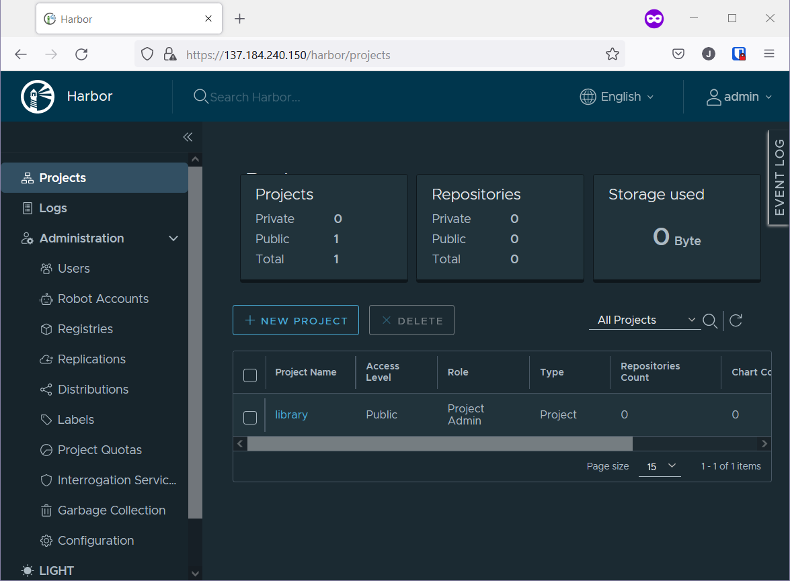
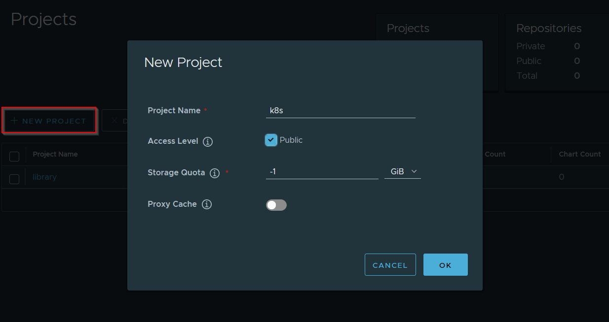
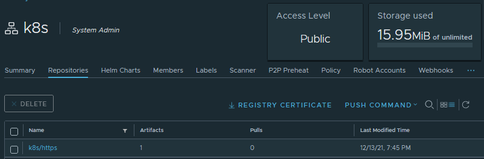

# DigitalOcean Kubernetes Challenge
This repo is for [DigitalOcean Kubernetes Challenge](https://www.digitalocean.com/community/pages/kubernetes-challenge)

I choose **Deploy an internal container registry**

### Choose your Challenge
New to Kubernetes? Try one of these challenges. You’ll get $60 in DigitalOcean credits for your project. 
- Deploy an internal container registry
Kubernetes does not provide an internal container registry but it is often useful to add one. There are many projects which enable you to deploy an internal container registry, such as Harbour or Trow.
- Deploy a log monitoring system
So your applications produce logs. Lots of logs. How are you supposed to analyze them? A common solution is to aggregate and analyze them using the ELK stack, alongside fluentd or fluentbit.
- Deploy a scalable SQL database cluster
When deploying a database on Kubernetes, you have to make it redundant and scalable. You can rely on database management operators like KubeDB or database-specific solutions like Kubegres for PostgreSQL or the MySQL Operator for MySQL. 
- Deploy scalable NoSQL database cluster
When it comes to cloud native, using No-SQL solutions has its advantages. You can deploy a cluster of MongoDB, Cassandra, or CouchDB instances to explore how to run a NoSQL database in Kubernetes. 

## Challenge runbook

Step 1: Install `doctl` - DigitalOcean CLI tool

Step: 2: Create a Kubernetes cluster

```
doctl kubernetes cluster create do-k8s-chlng
```
>OUTPUT

```
PS C:\> doctl kubernetes cluster create do-k8s-chlng
Notice: Cluster is provisioning, waiting for cluster to be running
........................................................................
Notice: Cluster created, fetching credentials
Notice: Adding cluster credentials to kubeconfig file found in "C:\\Users\\JaganSekaran(ASG)/.kube/config"
Notice: Setting current-context to do-nyc1-do-k8s-chlng
ID                                      Name            Region    Version        Auto Upgrade    Status     Node Pools
66004701-3294-4599-b2eb-811f391efead    do-k8s-chlng    nyc1      1.21.5-do.0    false           running    do-k8s-chlng-default-pool

```

Step 3: Harbor installation steps

Our challenge starts here. I'm using Bitnami [helm chart](https://bitnami.com/stack/harbor/helm) to deploy Harbor

Add bitnami repo to Helm

```
helm repo add bitnami https://charts.bitnami.com/bitnami
```
> OUTPUT
```
PS C:\LAB\harbor> helm repo add bitnami https://charts.bitnami.com/bitnami
"bitnami" has been added to your repositories
```

Before installing helm chart we need to edit the yaml file, so create a yaml file 
```
helm show values bitnami/harbor > harbor-values.yaml
```

open `harbor-values.yaml` in a editor

change the exterlname URL value to `externalURL: https://hub.jagan-sekaran.me` 

set admin password `harborAdminPassword: "<YOUR PASSWORD>"` and commaonName `commonName: 'hub.jagan-sekaran.me'`


Install Harbor via helm
```
helm install harbor bitnami/harbor --values harbor-values.yaml -n harbor --create-namespace
```
>OUTPUT
```PS
PS C:\LAB\harbor> helm install harbor bitnami/harbor --values harbor-values.yaml -n harbor --create-namespace
NAME: harbor
LAST DEPLOYED: Mon Dec 13 16:35:32 2021
NAMESPACE: harbor
STATUS: deployed
REVISION: 1
TEST SUITE: None
NOTES:
CHART NAME: harbor
CHART VERSION: 11.1.5
APP VERSION: 2.4.0

** Please be patient while the chart is being deployed **

1. Get the Harbor URL:

  NOTE: It may take a few minutes for the LoadBalancer IP to be available.
        Watch the status with: 'kubectl get svc --namespace harbor -w harbor'
  export SERVICE_IP=$(kubectl get svc --namespace harbor harbor --template "{{ range (index .status.loadBalancer.ingress 0) }}{{.}}{{ end }}")
  echo "Harbor URL: http://$SERVICE_IP/"

2. Login with the following credentials to see your Harbor application

  echo Username: "admin"
  echo Password: $(kubectl get secret --namespace harbor harbor-core-envvars -o jsonpath="{.data.HARBOR_ADMIN_PASSWORD}" | base64 --decode)
```

Check pods status - (everything is running now)

```PS
PS C:\LAB\harbor> kubectl get pod -n harbor
NAME                                    READY   STATUS    RESTARTS   AGE
harbor-chartmuseum-7fcffccd47-pftzv     1/1     Running   0          3m43s
harbor-core-85d8cf769d-8ngl6            0/1     Running   2          3m44s
harbor-jobservice-d79dc7b5b-4w5xt       0/1     Running   2          3m44s
harbor-nginx-8679695b9d-gs88w           1/1     Running   0          3m44s
harbor-notary-server-79bd9949d9-mk6l6   1/1     Running   0          3m44s
harbor-notary-signer-6f888ccbd-qr725    1/1     Running   0          3m43s
harbor-portal-58dfcc667d-jspp4          1/1     Running   0          3m43s
harbor-postgresql-0                     1/1     Running   0          3m43s
harbor-redis-master-0                   0/1     Pending   0          3m43s
harbor-registry-676f8ff5d6-lrz99        2/2     Running   0          3m44s
harbor-trivy-0                          0/1     Pending   0          3m43s
```

Get External-IP of Harbor loadbalancer

```
PS C:\LAB\git_repos\DO-K8s-Challenge> kubectl get svc -n harbor
NAME                         TYPE           CLUSTER-IP       EXTERNAL-IP       PORT(S)                                     AGE  
harbor                       LoadBalancer   10.245.3.255     178.128.134.115   80:31632/TCP,443:32216/TCP,4443:30376/TCP   5m42s
harbor-chartmuseum           ClusterIP      10.245.86.36     <none>            80/TCP                                      5m42s
harbor-core                  ClusterIP      10.245.216.29    <none>            80/TCP                                      5m42s
harbor-jobservice            ClusterIP      10.245.169.149   <none>            80/TCP                                      5m42s
harbor-notary-server         ClusterIP      10.245.173.18    <none>            4443/TCP                                    5m42s
harbor-notary-signer         ClusterIP      10.245.101.201   <none>            7899/TCP                                    5m42s
harbor-portal                ClusterIP      10.245.168.69    <none>            80/TCP                                      5m42s
harbor-postgresql            ClusterIP      10.245.166.148   <none>            5432/TCP                                    5m42s
harbor-postgresql-headless   ClusterIP      None             <none>            5432/TCP                                    5m42s
harbor-redis-headless        ClusterIP      None             <none>            6379/TCP                                    5m42s
harbor-redis-master          ClusterIP      10.245.226.204   <none>            6379/TCP                                    5m42s
harbor-registry              ClusterIP      10.245.85.236    <none>            5000/TCP,8080/TCP                           5m42s
harbor-trivy                 ClusterIP      10.245.85.179    <none>            8080/TCP                                    5m42s
```

use the external IP to login to Harbor
- UserName: admin
- Password: <PASSWORD_entered_on_yaml>



Create a new project and make it public, so pulling image doesn't need authentication.



Now lets try to push a container(httpd) image to Harbor

```
PS C:\LAB\harbor> docker images
REPOSITORY   TAG       IMAGE ID       CREATED       SIZE
httpd        alpine    da799a8c8856   13 days ago   54.9MB
```

first we need to tag our container 

```
docker tag httpd:alpine hub.jagan-sekaran.me/k8s/https:latest
```
>OUTPUT
```
PS C:\LAB\harbor> docker tag httpd:alpine hub.jagan-sekaran.me/k8s/https:latest
PS C:\LAB\harbor>

PS C:\LAB\harbor> docker images
REPOSITORY                       TAG       IMAGE ID       CREATED       SIZE
httpd                            alpine    da799a8c8856   13 days ago   54.9MB
hub.jagan-sekaran.me/k8s/https   latest    da799a8c8856   13 days ago   54.9MB
```

Login to `hub.jagan-sekaran.me` on Docker

*NOTE: if DNS is not resolved edit hosts file and add the IP of Harbor*

```
docker login hub.jagan-sekaran.me
```
>OUTPUT
```
PS C:\LAB\harbor> docker login hub.jagan-sekaran.me
Username: admin
Password: 
Login Succeeded
```

Now we can push our image to our hub

```docker
docker push hub.jagan-sekaran.me/k8s/https
```
>OUTPUT (Successfully pushed)
```
PS C:\LAB\harbor> docker push hub.jagan-sekaran.me/k8s/https
Using default tag: latest
The push refers to repository [hub.jagan-sekaran.me/k8s/https]
96f5fd70e155: Pushed
af93ffae5924: Pushed
71a62b93fe7b: Pushed
fc8c77d3c450: Pushed
83efd5aabbd5: Pushed
8d3ac3489996: Pushed
latest: digest: sha256:452c02d860075a7ed16d443d9dfde61755d62d15bffb6492c4ba0d4022590052 size: 1572
```

Image available at Harbor 



Lets deploy this app using [httpd-deployemnt.yaml](httpd-deployemnt.yaml) file

```
kubectl apply -f httpd-deployemnt.yaml
```
>OUTPUT
```
PS C:\LAB\git_repos\DO-K8s-Challenge> kubectl apply -f httpd-deployemnt.yaml
service/httpd-service unchanged
deployment.apps/httpd-deployment created

PS C:\LAB\git_repos\DO-K8s-Challenge> kubectl get pod
NAME                                READY   STATUS    RESTARTS   AGE
httpd-deployment-6559f66ffd-4pqlm   1/1     Running   0          9m58s
```

We created our Kubernetes internal container registry (Harbor) and pushed our local image to container registry. Finally our K8s deployment was able to pull the image from Harbor and spin-up a pod successfully.
